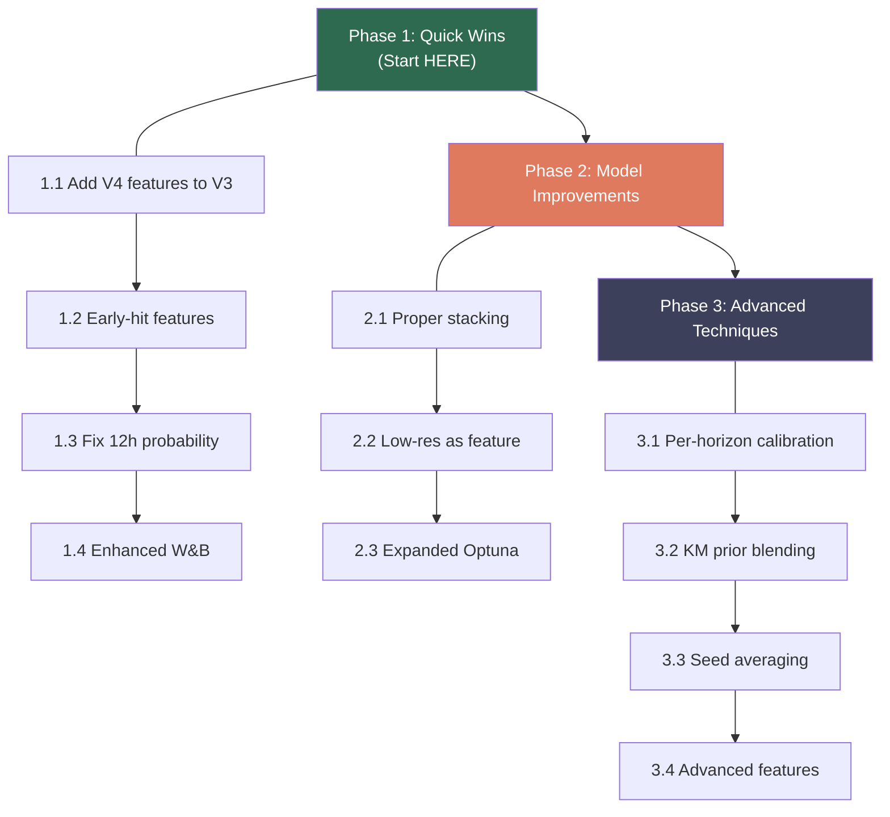

# WiDS 2025 — V5 Improvement Plan

## 1. Current State Assessment

### Dataset Overview
| Metric | Value |
|---|---|
| Training samples | **221** (very small!) |
| Hit events (event=1) | 69 (31.2%) |
| Censored (event=0) | 152 (68.8%) |
| Test samples | 95 |
| Raw numeric features | ~34 |
| Submission format | `prob_12h, prob_24h, prob_48h, prob_72h` |

### Hit Time Distribution (69 events)
| Bucket | Count | % | Insight |
|---|---|---|---|
| 0–6h | 44 | **63.8%** | ⚠️ Majority hit within 6 hours! |
| 6–12h | 5 | 7.2% | Sharp drop-off |
| 12–24h | 14 | 20.3% | Secondary cluster |
| 24–48h | 3 | 4.3% | Rare |
| 48–72h | 3 | 4.3% | Very rare |

> [!IMPORTANT]
> **~64% of all hits happen within the first 6 hours.** This is a critical insight — models should be heavily tuned for early-hour discrimination.

### Censored Time Patterns
- 81 censored samples (53%) have `time > 60h` — they survived almost the entire observation window
- 41 censored samples (27%) have `time > 65h` — likely "administrative censoring" at study end
- This means censored samples are heavily right-skewed → **standard survival models handle this well**

### Low Temporal Resolution Split
| Set | High-res (0) | Low-res (1) |
|---|---|---|
| Train | 161 (73%) | 60 (27%) |
| Test | 21 (22%) | **74 (78%)** |

> [!WARNING]
> **The test set is dominated by low-resolution data (78%)** while training has only 27% low-res. This distribution mismatch is critical — any "Specialist" model trained only on high-res data will predict for just 22% of the test set.

---

## 2. V3 vs V4 — Side-by-Side Comparison

### V3 ([ai_model_v3.py](file:///d:/wids/ai_model_v3.py)) — "The Proven Baseline"

| Aspect | Details |
|---|---|
| **Models** | GBSA + RSF + XGB + LGB (4-model ensemble) |
| **Tuning** | Optuna per-model, per-fold (25 trials each) |
| **Objective** | **Hybrid Score** (0.3×C-index + 0.7×(1−WBS)) — matches competition metric |
| **CV Strategy** | 5-fold × 3 repeats Stratified KFold |
| **Ensemble** | Grid-search blending on OOF Hybrid Score |
| **Probabilities** | GBSA/RSF: `predict_survival_function()` → direct probs |
| | XGB/LGB: isotonic regression calibration → probs |
| **12h Handling** | Heuristic: `prob_12h = prob_24h × 0.75` |
| **W&B** | ✅ Full integration (per-fold + final metrics + artifact) |
| **Strengths** | Robust, well-calibrated, optimizes actual competition metric |

### V4 ([ai_model_v4.py](file:///d:/wids/ai_model_v4.py)) — "The Experimental Upgrade"

| Aspect | Details |
|---|---|
| **Models** | RSF + XGB only (2 models) |
| **Tuning** | ❌ No Optuna — default hyperparameters |
| **Objective** | C-index only (no Hybrid Score) |
| **CV Strategy** | 5-fold × 3 repeats, but **on subsets** (Specialist/Generalist) |
| **Ensemble** | CoxPH stacking meta-model |
| **Probabilities** | ❌ **Heuristic scaling** — no real survival function probabilities |
| **12h Handling** | Same heuristic scaling as other horizons |
| **W&B** | Partial (disabled by default) |
| **New Ideas** | ✅ Specialist/Generalist split, ✅ Stacking, ✅ Label analysis, ✅ New features |

### Critical Issues in V4

> [!CAUTION]
> **Issue 1: Probability generation is fundamentally broken.**
> V4 converts final risk scores to probabilities using `StandardScaler + Sigmoid` — this is arbitrary and **not calibrated to actual event probabilities**. The Brier Score component (70% of competition metric) will suffer badly.

> [!WARNING]
> **Issue 2: Specialist/Generalist split is harmful with this data.**
> Training separate models for high-res (161 samples) and low-res (60 samples) means:
> - The "Generalist" trains on only **60 samples** with reduced features — severe underfitting
> - Test set is 78% low-res → most predictions come from the weakest model
> - With 221 total samples, splitting data reduces power dramatically

> [!WARNING]
> **Issue 3: No hyperparameter tuning.**
> Default RSF/XGB params on 221 samples will severely underperform tuned models.

> [!NOTE]
> **Issue 4: Only 2 models instead of 4.**
> Dropping GBSA and LGB removes diversity. On small datasets, ensemble diversity is critical.

---

## 3. Label Artifact Analysis Results

### Finding: No Rounding Bias Detected
```
Fractional part analysis of hit times:
  Near 0.0  (exact hours): 0 (0.0%)
  Near 0.25 (15 min):      0 (0.0%)
  Near 0.5  (30 min):      1 (1.4%)
  Near 0.75 (45 min):      1 (1.4%)

Decimal precision: All values have 6+ decimal places
→ NO evidence of manual rounding or minute-level binning
```

> [!NOTE]
> **Unlike the competitor's dataset, our target variable shows NO rounding artifacts.** The times appear to be computed from satellite observation timestamps, not manually entered. **No post-processing correction is needed.**

### Actionable Finding: Extreme Early-Hit Bias
The 0–6h bucket containing 64% of hits is the real "artifact" — it tells us:
1. **Feature for bucket membership** — a binary `likely_fast_hit` feature based on distance/speed thresholds could help
2. **Per-horizon calibration matters more** — the 12h and 24h predictions carry most of the discriminative signal
3. **48h/72h predictions are almost always low** — most events that will hit, hit early

---

## 4. V5 Improvement Plan — Prioritized Phases

### Phase 1: Quick Wins (Combine Best of V3 + V4) ⏱️ ~2h

These preserve V3's proven infrastructure while adding V4's best ideas.

#### 1.1 — Add V4's New Feature Engineering to V3
V4 introduced two good new features. Add them to `engineer_features()`:
```python
# From V4 — proven useful
df['night_closing_anomaly'] = df['is_night'] * df['closing_speed_m_per_h']
df['kinetic_threat_proxy']  = np.log1p(df['area_first_ha']) * (df['closing_speed_m_per_h']**2)
```

#### 1.2 — Add Early-Hit Features (from our label analysis)
```python
# Capture the 0-6h dominant pattern
df['fast_hit_signal'] = (df['dist_min_ci_0_5h'] < 5000) & (df['closing_speed_m_per_h'] > 500)
df['time_pressure']   = np.exp(-df['dist_min_ci_0_5h'] / 3000) * df['closing_speed_m_per_h']
df['log_urgency']     = np.log1p(df['urgency_ratio'])
```

#### 1.3 — Fix the 12h Probability (Not a Heuristic)
Currently: `prob_12h = prob_24h × 0.75` — this is arbitrary.
**Fix**: Add 12h to the `EVAL_HORIZONS` list so all models generate real `prob_12h` via survival functions / isotonic calibration.

```python
EVAL_HORIZONS = [12, 24, 48, 72]  # was [24, 48, 72]
# Update BRIER_WEIGHTS if needed for internal eval
```

#### 1.4 — Enhance W&B Logging
```python
# Log Optuna best params per model per fold
wandb.log({f"fold_{fold}/best_params/{model}": study.best_params})
# Log feature importance from GBSA
wandb.log({"feature_importance": wandb.Table(...)})
# Log per-model OOF scores (not just ensemble)
```

---

### Phase 2: Model Improvements ⏱️ ~3h

#### 2.1 — Stacking Meta-Model (V4's Best Idea, Done Right)
Replace V3's grid-search blending with a proper stacking approach, but **keep all 4 base models** and use **calibrated probabilities** as meta-features:

```python
# Meta-features = OOF calibrated probs at each horizon + risk ranks
meta_train = pd.DataFrame()
for model in model_list:
    meta_train[f'{model}_risk_rank'] = rankdata(oof_preds[model]['risk'])
    for h in EVAL_HORIZONS:
        meta_train[f'{model}_prob_{h}h'] = oof_preds[model]['probs'][h]

# L2 meta-model: Ridge regression or LightGBM with heavy regularization
from sklearn.linear_model import Ridge
meta_model = Ridge(alpha=10.0)  # Strong regularization for 221 samples
```

#### 2.2 — Temporal Resolution as Feature (Not as Data Split)
Instead of V4's Specialist/Generalist split (which wastes data), use `low_temporal_resolution_0_5h` **as a feature** and add interaction terms:

```python
df['low_res_x_dist']    = df['low_temporal_resolution_0_5h'] * df['dist_min_ci_0_5h']
df['low_res_x_urgency'] = df['low_temporal_resolution_0_5h'] * df['urgency_ratio']
```

> [!TIP]
> This lets models learn to weight features differently for low/high-res data without splitting the already-tiny dataset.

#### 2.3 — Expand Optuna Search Spaces
```python
# Add regularization params for XGB/LGB
'gamma':         trial.suggest_float('gamma', 0, 5),
'reg_alpha':     trial.suggest_float('reg_alpha', 1e-4, 10, log=True),
'reg_lambda':    trial.suggest_float('reg_lambda', 1e-4, 10, log=True),

# Increase trials for small dataset (fast anyway)
OPTUNA_TRIALS_PER_MODEL = 50  # was 25
```

---

### Phase 3: Advanced Techniques ⏱️ ~4h

#### 3.1 — Per-Horizon Specialist Calibration
Train separate isotonic regression calibrators for each horizon, using **all base model outputs** as features:

```python
for h in EVAL_HORIZONS:
    calibrator[h] = IsotonicRegression()
    # Combine all model probs at this horizon
    combined = np.column_stack([oof_preds[m]['probs'][h] for m in model_list])
    calibrator[h].fit(combined.mean(axis=1), binary_label_at_h)
```

#### 3.2 — Kaplan-Meier Prior Blending
Use the empirical survival curve as a prior and blend it with model predictions:

```python
from lifelines import KaplanMeierFitter
kmf = KaplanMeierFitter()
kmf.fit(y_time, event_observed=y_event)
km_prior = {h: 1 - kmf.predict(h) for h in HORIZONS}

# Blend: weighted average of model pred and KM prior
final_prob[h] = 0.85 * model_pred[h] + 0.15 * km_prior[h]
```

#### 3.3 — Seed Averaging / Repeated Training
With only 221 samples, variance is high. Average predictions across multiple seeds:

```python
for seed in [42, 123, 456, 789, 2025]:
    # Train full pipeline with different seed
    # Average final predictions
```

#### 3.4 — Advanced Feature Engineering
```python
# Geographic/vegetation interactions (if lat/lon available)
# Acceleration-based features
df['closing_decel']       = (df['dist_accel_m_per_h2'] < 0).astype(int)
df['fire_momentum']       = df['area_growth_rate_ha_per_h'] * df['centroid_speed_m_per_h']
df['threat_acceleration'] = df['closing_speed_m_per_h'] * df['dist_accel_m_per_h2']
# Percentile-based features (capture relative position in distribution)
for col in ['dist_min_ci_0_5h', 'closing_speed_m_per_h', 'area_first_ha']:
    df[f'{col}_pctile'] = df[col].rank(pct=True)
```

---

## 5. Recommended Implementation Order



## 6. Key Principle: V3 is the Foundation, V4 Provides Ideas

> [!IMPORTANT]
> **Do NOT replace V3 with V4.** V3 has:
> - ✅ Proper survival function → probability conversion
> - ✅ Hybrid Score optimization (matches competition metric)
> - ✅ 4-model diverse ensemble
> - ✅ Optuna tuning
> - ✅ Working W&B integration
> 
> **V5 = V3 infrastructure + V4's best ideas (new features, stacking concept, label analysis) + our new improvements**

## 7. Expected Impact Estimates

| Improvement | Expected Hybrid Score Gain | Confidence |
|---|---|---|
| Fix 12h probability | +0.01–0.03 | 🟢 High |
| New features (V4 + early-hit) | +0.005–0.015 | 🟢 High |
| Proper stacking replacing blending | +0.005–0.02 | 🟡 Medium |
| Low-res interaction features | +0.005–0.01 | 🟡 Medium |
| Expanded Optuna | +0.002–0.01 | 🟡 Medium |
| KM prior blending | +0.002–0.008 | 🟡 Medium |
| Seed averaging | +0.003–0.01 | 🟢 High |
| Per-horizon calibration | +0.005–0.015 | 🟡 Medium |
